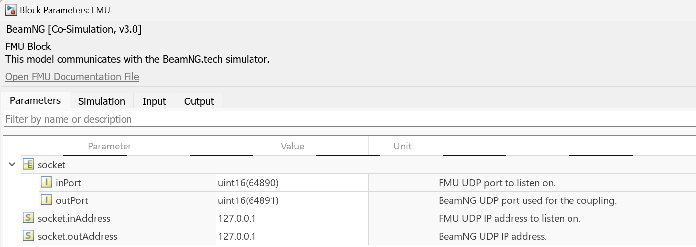

# BeamNG FMU

A BeamNG FMU for the [Functional Mock-up Interface](https://fmi-standard.org/).

## Run BeamNG FMU in Simulink

1. Obtain any example from [BeamNG-MATLAB-Simulink-integration](https://github.com/BeamNG/BeamNG-MATLAB-Simulink-integration/tree/main/examples/simulink/FMI). It is located in the `examples/simulink/FMI` folder.
2. Obtain the FMU file. You can either build it yourself by using the [instructions](#build-the-fmu) in this repository, or use the pre-built files from the [this](https://github.com/BeamNG/BeamNG-MATLAB-Simulink-integration/tree/main/src/lib) folder. FMI 3 for Co-Simulation and FMI 2 for Co-Simulation versions are supported.
3. Open the `FMI2.slx` or `FMI3.slx` in Simulink. You should see the following model:
  
   
   **Figure 1**: The FMU-Simulink model

4. Double-click the red FMU block. Specify the path to the BeamNG-FMU file of the version of your choice. The block should now include the "BeamNG" text.
5. To edit the FMU parameters (in/out ports, simulation time), double-click the FMU file.

   
   **Figure 2**: The FMU-Simulink model parameters
    
6. Start the vehicle coupling using the same [instructions](https://github.com/BeamNG/BeamNG-MATLAB-Simulink-integration?tab=readme-ov-file#instructions) as for the S-function Simulink integration. You can also use the `Ctrl+Shift+V` shortcut to start the coupling in BeamNG instead of loading the controller through the console. The vehicle should start moving, and you should see a view similar to this:

   

## Run BeamNG FMU with fmusim

You can use the [fmusim](fmusim) executable to simulate an FMU:

```commandline
> fmusim --help
Usage: fmusim [OPTION]... [FMU]
Simulate a Functional Mock-up Unit and write the output to result.csv.

  --help                           display this help and exit
  --interface-type [me|cs]         the interface type to use
  --tolerance [TOLERANCE]          relative tolerance
  --start-time [VALUE]             start time
  --stop-time [VALUE]              stop time
  --output-interval [VALUE]        set the output interval
  --start-value [name] [value]     set a start value
  --output-variable [name]         record a specific variable
  --input-file [FILE]              read input from a CSV file
  --output-file [FILE]             write output to a CSV file
  --log-fmi-calls                  log FMI calls
  --fmi-log-file [FILE]            set the FMI log file
  --solver [euler|cvode]           the solver to use
  --early-return-allowed           allow early return
  --event-mode-used                use event mode
  --record-intermediate-values     record outputs in intermediate update
  --initial-fmu-state-file [FILE]  file to read the serialized FMU state
  --final-fmu-state-file [FILE]    file to save the serialized FMU state
```

Example:
  ```\fmusim\BeamNG.fmu```  simulate with the default settings

## Repository Structure

```
<model>
├── config.h                    # model specific types and definitions
├── FMI{1CS|1ME|2|3}.xml        # model descriptions
└── model.c                    # implementation of the model

include
├── fmi{|2|3}Functions.h        # FMI header files
├── model.h                    # generic model interface
└── cosimulation.h            # generic co-simulation interface

src
├── fmi{1|2|3}Functions.c       # FMI implementations
└── cosimulation.c            # generic co-simulation

examples
├── *.c                        # various FMI 3.0 import examples
└── Examples.cmake            # CMake configuration for the example projects

fmusim
└── sources of the fmusim executable
```

## Build the FMU

To build the FMU, you need [CMake](https://cmake.org/) and a supported [build tool](https://cmake.org/cmake/help/latest/manual/cmake-generators.7.html) (e.g., Visual Studio ≥ 2013, Xcode, or make):

1. Download or clone the repository.
2. Open the [CMakeGUI](https://cmake.org/runningcmake/).
3. Click `Browse Source...` and select the cloned or downloaded and extracted repository (containing `CMakeLists.txt`).
4. Click `Browse Build...` and select the folder where you want to build the FMUs.
5. Click `Configure` and select the generator for your IDE/build tool.
6. Select the `FMI_VERSION` you want to build and optionally the `FMI_TYPE` (only for FMI 1.0).
7. Click `Generate` to generate the project files.
8. Click `Open Project` or open the project in your build tool.
9. Build the project.

The FMUs will be in the `dist` folder inside the selected build folder.

## Building fmusim

To build the `fmusim` executable, run the `build/build_*.py <platform>` Python scripts (where `<platform>` is the platform to build for, e.g., `x86_64-windows`) and enable `WITH_FMUSIM` before generating the CMake project.


## License and Attribution

Copyright &copy; 2024, BeamNG GmbH.
All rights reserved.
The code is released under the [2-Clause BSD License](LICENSE.txt).

The [BeamNG FMU](https://github.com/beamng/beamng-fmu) is a fork of the [Reference FMUs](https://github.com/modelica/Reference-FMUs) by Modelica Association Project, which are a fork of the [Test FMUs](https://github.com/CATIA-Systems/Test-FMUs) by Dassault Syst&egrave;mes, which are a fork of the [FMU SDK](https://github.com/qtronic/fmusdk) by QTronic, all of which are released under the 2-Clause BSD License.
